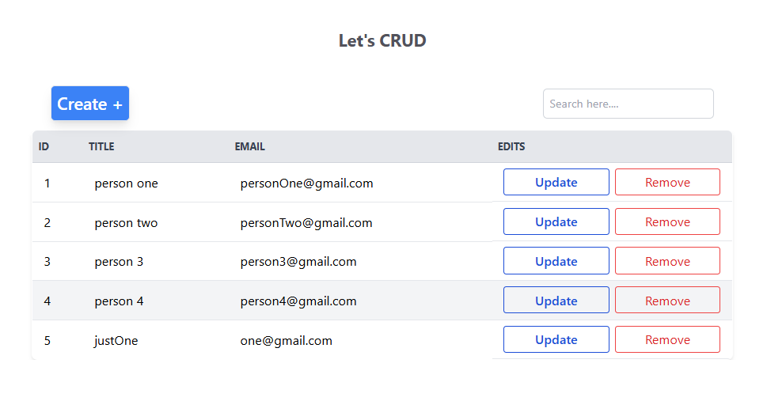
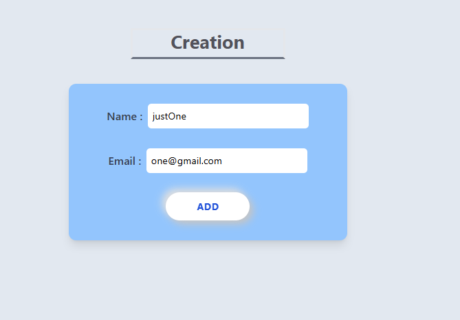
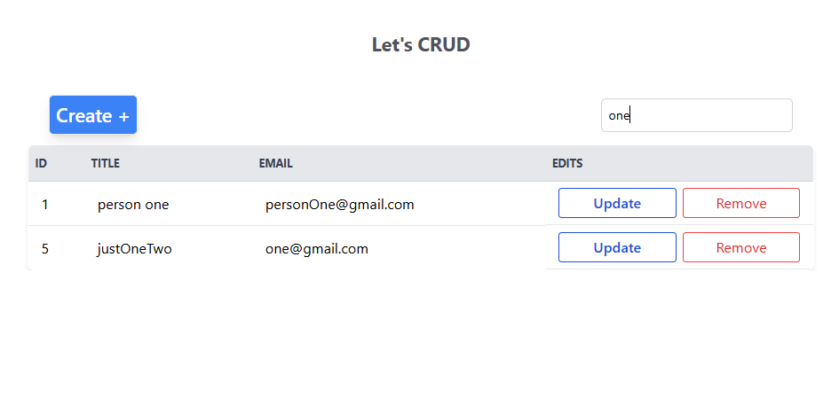

# React CRUD + Search App ✨

This is a simple, clean and functional **CRUD (Create, Read, Update, Delete)** application built with **React** and **Redux Toolkit**. 
It also includes a **search** functionality to filter the displayed data dynamically.
---

## ✨ Features

- 📝 Create new items
- 📋 View all items in a list
- ✏️ Edit existing items
- 🗑️ Delete items
- 🔍 **Search** functionality to filter items by keyword
- 🔄 State management via **Redux Toolkit**

---

## 🛠️ Tech Stack

- **Frontend**: React (Functional Components)
- **State Management**: Redux Toolkit (RTK)
- **Styling**: CSS / Tailwind 

---

## 🖼️ Screenshots

| Home View | Add/Edit | Update | Search in Action |
|-----------|----------|------------------|
|  |  |  |  |

---

## ▶️ Getting Started

### 1. Clone the repository

```bash
git clone https://github.com/RobiMankhinStart/CRUD.git
cd CRUD
npm install
npm run dev
